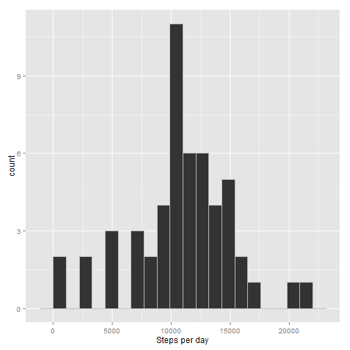
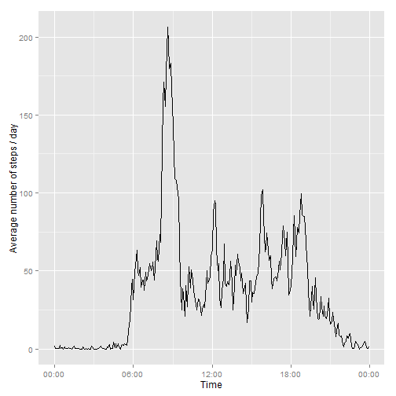
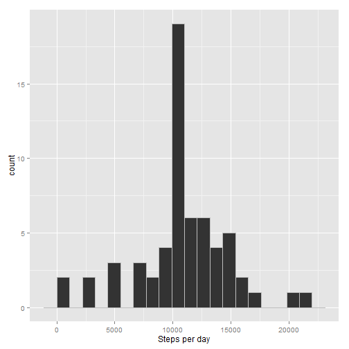
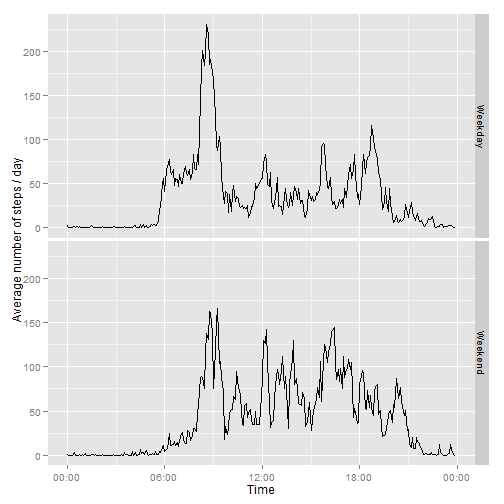

# Coursera | Reprodusible Research | Assignment 1
========================================================
## This is a report of activity monitoring data analysis, written according to the assignment 1 instructions.

## Note: for the correct code performance 1) the data folder schould be downloaded and file should be unzipped into the working directory, 2) "ggplot2" and "scales" packages should be installed.


## 1) Reading data into R and its primary processing:


```r
activity<-read.csv("activity.csv", na.strings="NA")
library(ggplot2)
```

## 2) Figuring out the mean total number of steps taken per day:

Summing up the total number of steps for each day and look at the histogram (total number of steps against the day) of the sums.


```r
# Summing up number of steps per day:
day_step_sum <- aggregate(activity$steps ~ activity$date, sum, data=activity)
colnames(day_step_sum) <- paste(c("date", "steps"))

# Making the histogramm:
ggplot(day_step_sum, aes(x=day_step_sum$steps)) + geom_histogram(binwidth=1100, colour="gray") + scale_x_continuous("Steps per day")
```

 

Calculating the mean and the median total number of steps taken per day.


```r
day_step_mean <- mean(day_step_sum$steps)
day_step_median <- median(day_step_sum$steps)
```

It turns out, the respective mean is 1.0766 &times; 10<sup>4</sup>, and the median is 10765.

## 3) Investigating the daily activity pattern:

How average number of steps changes at each 5-minute-time interval across all days:


```r
# Calculating averages of number of steps for each 5-minute-time interval
int_step_mean <- aggregate(activity$steps ~ activity$interval, mean, data=activity)
colnames(int_step_mean) <- paste(c("interval", "mean_steps"))
interv <- strptime(sprintf("%04d", int_step_mean$interval), format="%H%M")

# Making a proper dataframe for the plot:
mean_int <- cbind(interv, int_step_mean)
mean_int <- mean_int[,c("interv", "mean_steps")]
mean_int$interv <- as.POSIXct(mean_int$interv)

# Plotting the number of steps, averaged across all days for each time interval:
library(scales)
p2 <- ggplot(mean_int,aes(mean_int$interv, mean_int$mean_steps))+geom_line()+xlab("Time")+ylab("Average number of steps / day")
p2+scale_x_datetime(labels=date_format("%H:%M"))
```

 

Calculating the interval with the maximum number of steps average:

```r
max_st <- mean_int[mean_int$mean_steps==max(mean_int$mean_steps),]
max_st <- max_st[,1]
max_st <- strftime(max_st, format="%H:%M:%S")
```

The interval is 08:35:00.

## 4) Inputing missing values:

Calculating the total numer of NAs in the dataset:

```r
# Number of missing values in the initial dataset:
na_total <- sum(!complete.cases(activity))
```
The number equals to 2304.

Now, let's create a dataset "activity_f", identical to the initial dataset "activity", and fill in its missing values, using the rounded mean for the respective 5-minute interval.

```r
activity_f <- activity
activity_f$steps[is.na(activity_f$steps)] <- "a" 
for (i in 1:nrow(activity_f)){
    position <- match(activity_f[i, "interval"], int_step_mean$interval)    
    if(activity_f[i, "steps"] == "a") {
        activity_f[i, "steps"] <- paste(round(int_step_mean[position, "mean_steps"], digits=2))
    }        
    i <- i+1
}

na_total_2 <- sum(!complete.cases(activity_f))
```
In the modified dataset, the number of rows with missing values is 0.

Now, let's make a histogram of the total number of steps per day, using  dataset with filled NAs. 

```r
# Summing up number of steps per day with aggregate() function:
activity_f$steps <- as.numeric(activity_f$steps)
day_step_sum_f <- aggregate(activity_f$steps ~ activity_f$date, sum, data=activity_f)
colnames(day_step_sum_f) <- paste(c("date", "steps"))

# Making the histogramm:
ggplot(day_step_sum_f, aes(x=day_step_sum_f$steps)) + geom_histogram(binwidth=1100, colour="gray") + scale_x_continuous("Steps per day")
```

 

And calculate the mean and the median of the total number of steps per day.

```r
day_step_mean_f <- mean(day_step_sum_f$steps)
day_step_median_f <- median(day_step_sum_f$steps)
```

The calculated mean is 1.0766 &times; 10<sup>4</sup> (compared with 1.0766 &times; 10<sup>4</sup> in the case of the initial dataset), and the median is 1.0766 &times; 10<sup>4</sup> (compared with 10765 in the case of the initial dataset).
As we see, after substituting NAs with mean values for the respective interval, the mean has not changed, and the meadian has a bit lessened and become exactly equal to the mean.

## 5) Finding out differences in activity patterns between weekdays and weekends:

Let's add a column to the modified dataset, indicating, if the day is a weekday or a weekend.

```r
Sys.setlocale(category = "LC_ALL", locale = "English_USA")
activity_f$date <- as.Date(activity_f$date)
activity_f$day <- weekdays(activity_f$date, abbreviate=TRUE)

activity_f$day <- gsub("Mon", "Weekday", activity_f$day)
activity_f$day <- gsub("Tue", "Weekday", activity_f$day)
activity_f$day <- gsub("Wed", "Weekday", activity_f$day)
activity_f$day <- gsub("Thu", "Weekday", activity_f$day)
activity_f$day <- gsub("Fri", "Weekday", activity_f$day)
activity_f$day <- gsub("Sat", "Weekend", activity_f$day)
activity_f$day <- gsub("Sun", "Weekend", activity_f$day)
activity_f$day <- as.factor(activity_f$day)
```

Now, we can plot the average number of steps for each 5-minute interval specifically for weekdays and weekends:

```r
# Splitting the data into weekday- and weekend-related:
activity_f_sp <- split(activity_f, activity_f$day)
weekday <- activity_f_sp[[1]]
weekend <- activity_f_sp[[2]]

# Calculating averages of number of steps for each 5-minute-time interval:
weekday_mean <- aggregate(weekday$steps ~ weekday$interval, mean, data=weekday)
colnames(weekday_mean) <- paste(c("interval", "mean_steps"))
interv_weekday <- strptime(sprintf("%04d", weekday_mean$interval), format="%H%M")
weekend_mean <- aggregate(weekend$steps ~ weekend$interval, mean, data=weekend)
colnames(weekend_mean) <- paste(c("interval", "mean_steps"))
interv_weekend <- strptime(sprintf("%04d", weekend_mean$interval), format="%H%M")

# Making a proper dataframe for the plot:
weekday_all <- cbind(weekday_mean, interv_weekday)
weekday_all$day <- rep_len("Weekday", 288)
weekday_all <- weekday_all[,c("mean_steps", "interv_weekday", "day")]
colnames(weekday_all) <- paste(c("mean_steps", "interval", "day"))
weekend_all <- cbind(weekend_mean, interv_weekend)
weekend_all$day <- rep_len("Weekend", 288)
weekend_all <- weekend_all[,c("mean_steps", "interv_weekend", "day")]
colnames(weekend_all) <- paste(c("mean_steps", "interval", "day"))
week_all <- rbind(weekday_all, weekend_all)
week_all$interval <- as.POSIXct(week_all$interval)
week_all$day <- as.factor(week_all$day) 

# Plotting the number of steps, averaged across all days for each time interval:
library(scales)
p3 <- ggplot(week_all,aes(week_all$interval, week_all$mean_steps))+geom_line()+xlab("Time")+ylab("Average number of steps / day")
p3 <- p3+scale_x_datetime(labels=date_format("%H:%M"))
p3 + facet_grid(day ~ ., scales="free_x")
```

 


